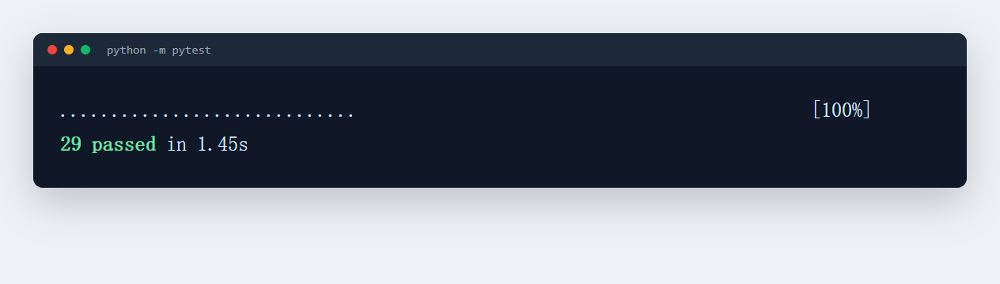
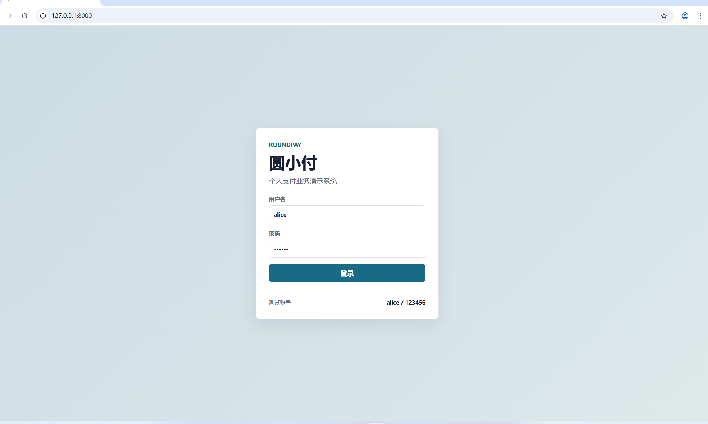
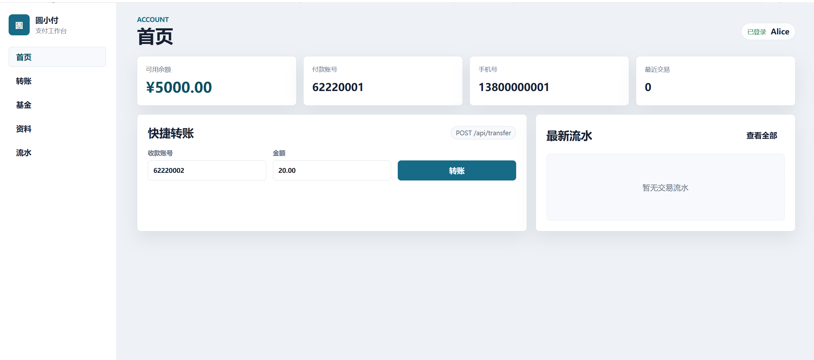
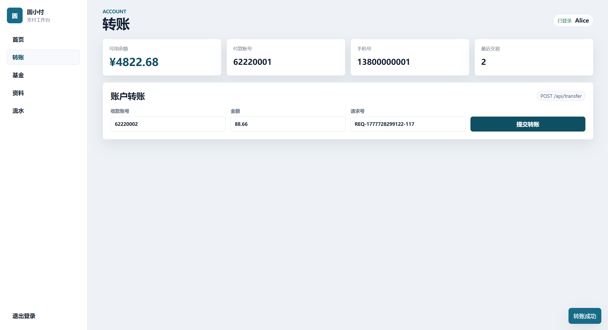
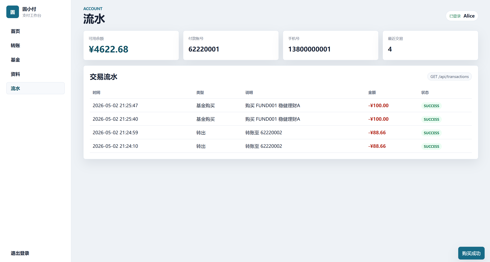
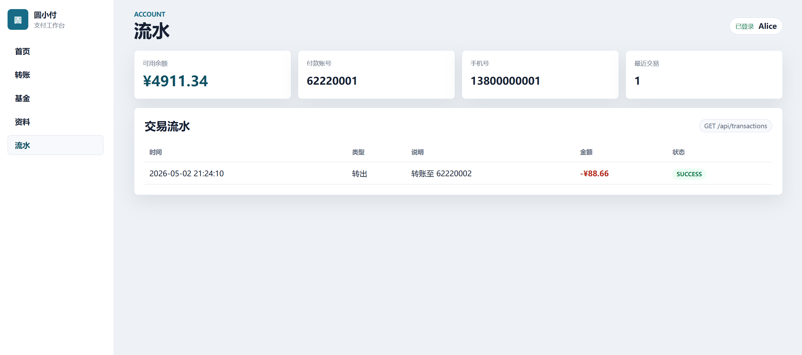
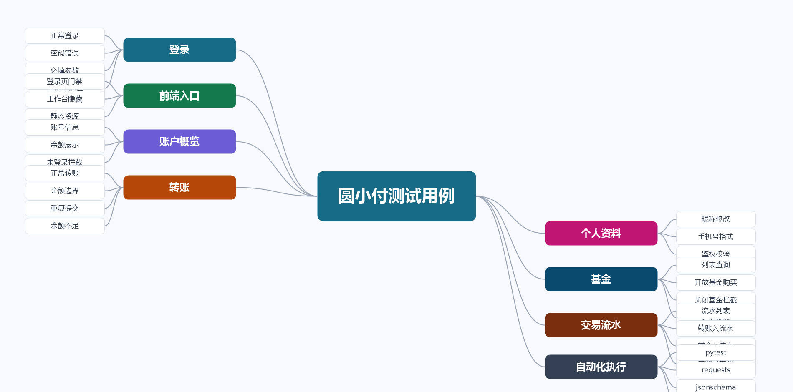

# 圆小付系统接口测试记录

[](https://github.com/keke-vs/roundpay-api-test/actions/workflows/python-tests.yml)

这个仓库记录了我针对“圆小付”支付场景做的一次接口测试练习。项目没有接入真实支付通道，后端部分使用本地 mock 服务模拟，重点放在测试思路、用例设计、自动化脚本和性能测试记录上。

我把测试范围收在几个支付系统里比较常见、也比较容易出问题的场景：登录鉴权、账户转账、个人信息修改、基金查询和基金购买。相比只验证接口能不能调通，我更关注金额边界、重复提交、余额变化、接口返回结构和异常提示这些问题。

## 1. 项目背景

圆小付是一个简化版的个人支付系统，主要业务链路包括：

- 用户登录后获取 Token
- 用户向指定账户发起转账
- 用户修改昵称和手机号
- 用户查询基金列表
- 用户购买开放状态的基金产品

这个项目的目标不是做一个完整业务系统，而是把支付类接口测试中常见的风险点拆出来，用一套可运行的测试代码保存下来，后面复习接口测试、自动化测试和性能测试时可以直接参考。

## 2. 测试目标

- 验证核心接口是否符合基本业务规则
- 检查登录鉴权是否能拦截未授权请求
- 检查转账金额边界、余额变化和重复提交处理
- 检查基金购买时的基金状态、起购金额和余额校验
- 使用 `jsonschema` 校验接口响应结构，避免字段变化影响前端解析
- 使用 JMeter 记录基金购买链路的基础压测思路

## 3. 技术栈

| 类型 | 工具 |
| --- | --- |
| 接口服务 | Python `http.server` 本地 mock |
| 前端页面 | 原生 HTML、CSS、JavaScript |
| 自动化测试 | pytest、requests |
| 响应结构校验 | jsonschema |
| 测试报告 | Allure 原始结果 |
| 接口调试 | Postman |
| 性能测试 | JMeter |
| 持续集成 | GitHub Actions |

## 4. 项目结构

```text
roundpay-api-test
├── api/
│   └── roundpay_server.py          # 本地 mock 接口服务
├── docs/
│   ├── api_spec.md                 # 接口说明
│   ├── bug_report_sample.md        # 缺陷记录样例
│   ├── risk_checklist.md           # 测试风险清单
│   ├── test_cases.md               # 核心测试用例
│   ├── test_plan.md                # 测试计划
│   └── test_record_2026_04.md      # 测试执行记录
├── frontend/
│   ├── index.html                  # 圆小付登录页和业务工作台
│   ├── app.css                     # 页面样式
│   └── app.js                      # 页面交互和接口调用
├── jmeter/
│   └── fund_buy_load_test.jmx      # 基金购买链路压测脚本
├── postman/
│   └── RoundPay.postman_collection.json
├── tests/
│   ├── conftest.py                 # 启动 mock 服务和登录夹具
│   ├── schemas.py                  # 响应结构校验规则
│   ├── test_login.py
│   ├── test_transfer.py
│   ├── test_profile.py
│   └── test_fund_buy.py
├── pytest.ini
└── requirements.txt
```

## 5. 系统功能说明

### 5.0 前端业务系统

本项目现在提供一个明确的前端系统，启动 mock 服务后访问 `http://127.0.0.1:8000/` 即可打开“圆小付”。

页面采用先登录、后进入业务工作台的结构。未登录时只展示登录页；登录成功后进入首页，可操作账户概览、快捷转账、基金产品、个人资料和交易流水。页面直接调用同源 mock API，不需要额外启动 Node 服务，也不需要构建步骤。

### 5.1 登录

用户使用用户名和密码登录。登录成功后接口返回 Token、账号和昵称，后续转账、修改资料、基金购买等接口都需要携带 Token。

测试时重点看两件事：一是正确账号能否登录成功，二是密码错误、用户名为空、密码为空时是否返回明确错误，不应出现空响应或服务异常。

### 5.2 转账

用户登录后可以向指定账户转账。接口会校验收款账户、转账金额、账户余额和请求号。

这部分是本项目里最重要的测试点。支付类接口不能只看返回 `success`，还要看付款方余额是否减少、收款方余额是否增加、重复提交时是否重复扣款。

### 5.3 个人信息修改

用户登录后可以修改昵称和手机号。接口会做手机号格式校验，未登录用户不能修改个人信息。

这个模块本身不复杂，主要用于覆盖 PATCH 请求、参数格式校验和鉴权校验。

### 5.4 基金查询与购买

用户可以查询基金列表，并购买开放状态的基金。购买前需要校验基金是否存在、基金是否开放、购买金额是否达到起购金额，以及用户余额是否足够。

基金购买链路也放入了 JMeter 脚本中，用来记录基础性能测试的设计方式。

### 5.5 交易流水

系统会记录转账和基金购买产生的交易流水。用户登录后可以查询自己的流水，前端首页展示最近流水，流水页面展示完整列表。

## 6. 测试范围

| 模块 | 已覆盖内容 | 暂未覆盖内容 |
| --- | --- | --- |
| 登录 | 正常登录、密码错误、必填参数、Token 返回 | 验证码、登录锁定、多端登录 |
| 转账 | 正常转账、金额边界、重复提交、未登录访问 | 真实账务流水、事务回滚、跨行转账 |
| 个人信息 | 昵称修改、手机号格式、鉴权 | 头像上传、敏感信息脱敏 |
| 基金查询 | 分页查询、字段完整性 | 复杂筛选、排序、缓存 |
| 基金购买 | 正常购买、起购金额、基金关闭、余额不足 | 支付回调、订单撤销、清算流程 |

## 7. 测试设计

### 7.1 登录接口

登录接口的用例按输入参数拆分：

- 正确用户名和密码：返回 200，并返回 Token
- 密码错误：返回 401
- 用户名为空：返回 400
- 密码为空：返回 400

自动化测试中除了校验状态码，还使用 `jsonschema` 校验成功响应必须包含 `token`、`account`、`nickname`。

### 7.2 转账接口

转账接口的风险集中在金额和重复提交：

- 金额为 0 时应拒绝
- 金额为负数时应拒绝
- 金额超过两位小数时应拒绝
- 收款账户不存在时应拒绝
- 用户未登录时应拒绝
- 同一个 `requestId` 重复提交时，不应重复扣款

重复提交用例示例：

```python
def test_transfer_idempotent_by_request_id(base_url, auth_headers):
    request_id = f"REQ-{uuid.uuid4()}"
    payload = {"toAccount": "62220002", "amount": 20.00, "requestId": request_id}

    first = requests.post(
        f"{base_url}/api/transfer",
        json=payload,
        headers=auth_headers,
        timeout=3,
    ).json()
    second = requests.post(
        f"{base_url}/api/transfer",
        json=payload,
        headers=auth_headers,
        timeout=3,
    ).json()

    assert first["data"] == second["data"]
```

这个断言比较直接：如果第二次返回的数据和第一次一致，说明同一个请求号没有再次生成新的扣款结果。

### 7.3 基金购买接口

基金购买接口按业务状态拆分：

- 基金存在且开放，金额满足起购要求，余额充足：购买成功
- 金额低于起购金额：购买失败
- 基金已关闭：购买失败
- 基金不存在：购买失败
- 用户未登录：购买失败

这里没有把所有组合都写进自动化代码，主要保留了最能说明问题的路径。后续如果接入数据库，可以继续补充余额不足、交易流水和订单状态校验。

## 8. 自动化实现

自动化用例使用 pytest 编写。`conftest.py` 会在测试开始时启动本地 mock 服务，并提供登录后的请求头，测试用例不需要手动维护 Token。

```python
@pytest.fixture()
def auth_headers(base_url):
    response = requests.post(
        f"{base_url}/api/login",
        json={"username": "alice", "password": "123456"},
        timeout=3,
    )
    token = response.json()["data"]["token"]
    return {"Authorization": f"Bearer {token}"}
```

接口返回结构使用 `jsonschema` 做基础约束。这样做的原因是：接口字段变动有时不会导致状态码失败，但会影响前端取值，结构校验能更早发现这类问题。

## 9. 本地运行

安装依赖：

```bash
pip install -r requirements.txt
```

执行自动化测试：

```bash
pytest
```

生成 Allure 原始结果：

```bash
pytest --alluredir=reports/allure-results
```

如果本地已安装 Allure CLI，可以查看报告：

```bash
allure serve reports/allure-results
```

单独启动 mock 服务：

```bash
python api/roundpay_server.py
```

服务地址：

```text
http://127.0.0.1:8000
```

前端页面：

```text
http://127.0.0.1:8000/
```

## 10. 当前测试结果

最近一次本地执行结果：

```text
29 passed in 1.45s
```



当前自动化覆盖：

- 登录接口 4 条
- 账户概览接口 2 条
- 转账接口 7 条
- 个人信息接口 5 条
- 基金查询与购买接口 5 条
- 交易流水接口 4 条
- 前端页面与静态资源 2 条

GitHub Actions 也配置了自动执行 pytest，后续每次推送到 `main` 分支都会跑一遍自动化用例。

## 11. 系统截图

### 登录页



### 首页工作台



### 转账页面



### 基金页面



### 交易流水



## 12. 测试用例和思维导图

完整测试用例见：

```text
docs/test_cases.md
```

测试用例思维导图：



XMind 原文件：

```text
docs/mindmap/roundpay-test-cases.xmind
```

## 13. Postman 记录

`postman/RoundPay.postman_collection.json` 中保留了登录、转账和基金购买接口，主要用于手工调试和快速复现。

使用方式：

1. 启动本地 mock 服务
2. 在 Postman 导入集合
3. 将 `baseUrl` 设置为 `http://127.0.0.1:8000`
4. 登录成功后把返回的 Token 填到集合变量 `token`
5. 执行转账或基金购买接口

## 14. 性能测试记录

JMeter 脚本位于：

```text
jmeter/fund_buy_load_test.jmx
```

当前脚本设置：

| 配置项 | 值 |
| --- | --- |
| 线程数 | 20 |
| Ramp-Up | 10 秒 |
| 循环次数 | 5 |
| 请求接口 | `/api/fund/buy` |
| 请求方式 | POST |

这份脚本主要用于记录压测思路，不代表真实线上容量。因为当前服务是本地 mock，性能数据只能作为练习参考。真正的性能测试还需要结合数据库、缓存、服务端 CPU、内存、慢查询和日志一起分析。

我在这个场景里关注的不是单个数字，而是测试方法：

- 并发请求下是否出现失败
- 平均响应时间是否稳定
- 最大响应时间是否明显偏高
- 业务接口是否存在一次性返回数据过多的问题
- 优化后是否需要重新做回归测试

## 15. 缺陷记录样例

缺陷样例保存在：

```text
docs/bug_report_sample.md
```

示例问题是“基金购买接口响应时间偏高”。记录时按真实缺陷报告的思路整理，包括严重程度、测试环境、复现步骤、实际结果、预期结果、初步分析和建议方案。

我没有把它写成“已经线上发现的真实缺陷”，因为这个项目本身是本地练习环境。这样写更符合项目实际，也避免夸大。

## 16. 项目边界

这个项目目前还有明显边界：

- 没有接入真实数据库，余额校验来自 mock 服务内存数据
- 没有实现短信验证码、银行卡实名、支付回调和账务清算
- 没有接入服务端资源监控，性能测试结果只能看作练习记录
- 自动化用例还没有覆盖所有参数组合
- Postman 集合没有配置完整的前置脚本和环境切换
- 前端页面用于演示和手工验证 mock API，登录态保存在浏览器 `sessionStorage`，不包含真实生产鉴权和前端工程化构建

这些边界我保留下来，是为了让项目记录更真实。测试项目不应该只写做了什么，也要说明哪些地方暂时没有做。

## 17. 后续计划

后续准备继续补充：

- 增加 SQLite 或 MySQL，用 SQL 校验余额和交易流水
- 增加更多转账异常场景，例如余额不足、收款账户冻结、重复请求号不同金额
- 给 Postman 集合补充测试脚本和环境变量
- 生成 Allure 报告截图，方便记录测试结果
- 增加 Jenkins 或 GitHub Actions 的测试报告归档
- 对 JMeter 脚本补充聚合报告截图和分析记录
- 将前端交互测试升级为 Playwright 端到端测试
